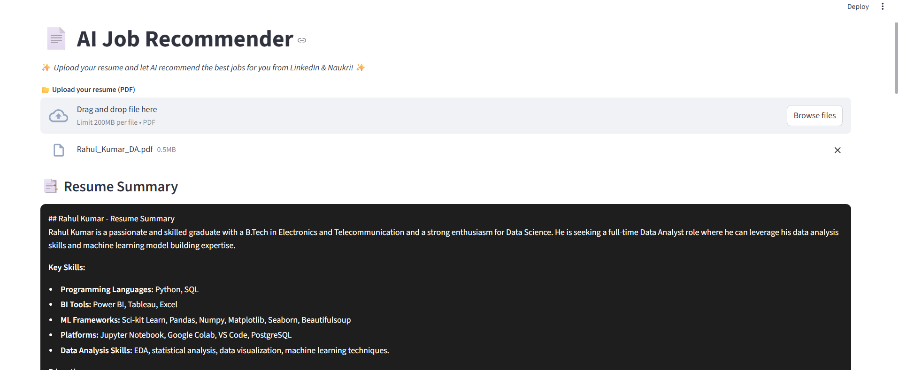
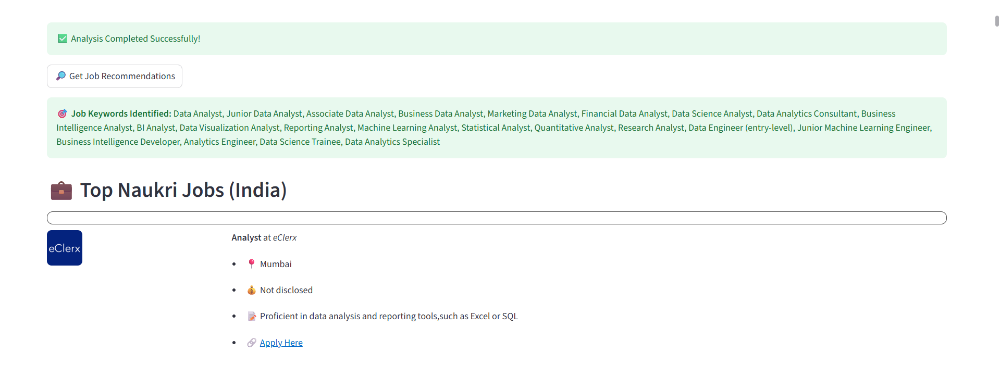

# 📄 AI Job Recommender

This project recommends jobs based on a user’s resume by parsing the document, summarizing it, identifying skill gaps, and suggesting the next steps. It also scrapes LinkedIn jobs using the Scrapdog API and integrates multiple APIs for intelligent recommendations.

---

## 🚀 Features


* **Resume Parsing** using PyMuPDF
* **Summary Generation** of candidate’s experience and skills
* **Skill Gap Analysis** for next career steps
* **Job Recommendations** from LinkedIn (via Scrapdog API)
* **Streamlit UI** for easy interaction
* **LangChain Integration** for AI-powered text processing with Gemini models
* **.env file support** for managing API keys securely


---

## 🛠️ Tech Stack & Libraries

* **Python**
Here’s your updated list with **LangChain** and the Scrapingdog link added:

* [Streamlit](https://streamlit.io/) – Web app framework
* [PyMuPDF](https://pymupdf.readthedocs.io/) – PDF text extraction
* [python-dotenv](https://pypi.org/project/python-dotenv/) – Environment variable management
* [apify-client](https://pypi.org/project/apify-client/) – API integration
* [LangChain](https://www.langchain.com/) – AI workflow orchestration with Gemini models
* [Scrapdog API](https://www.scrapingdog.com/) – LinkedIn job scraping


---

## 📂 Project Structure

```
AI-Job-Recommender/
│
├── screenshots/                # Project screenshots
│   ├── resume_summary.png       # Resume summary screenshot
│   ├── job_recommendations.png  # Job recommendation screenshot
│
├── src/                         # Source code
│   ├── helper.py                # Resume parsing, summarization, skill gap analysis
│   ├── fetch_job.py              # Job fetching from LinkedIn
│
├── .env                         # Environment variables (API keys)
├── requirements.txt             # Python dependencies
├── app.py                       # Streamlit app entry point
└── README.md                    # Project documentation
```

---

## 📸 Screenshots

**Resume Summary after Upload**


**Job Recommendations**


---

## ⚙️ Installation & Usage

1️⃣ **Clone the Repository**

```bash
git clone https://github.com/yourusername/AI-Job-Recommender.git
cd JobScraper-LLM-ResumeSummarizer
```

2️⃣ **Create & Activate Virtual Environment**

```bash
python -m venv venv
venv\Scripts\activate  # Windows
source venv/bin/activate  # Mac/Linux
```

3️⃣ **Install Dependencies**

```bash
pip install -r requirements.txt
```

4️⃣ **Set Environment Variables**
Create a `.env` file and add:

```bash
GEMINI_API_KEY = your_api_key
SCRAPDOG_API_KEY=your_api_key
APIFY_API_KEY=your_api_key
```

5️⃣ **Run the App**

```bash
streamlit run app.py
```

---

## 📬 Contact

📧 Email: **[rahulkumar.19k8@gmail.com](mailto:rahulkumar.19k8@gmail.com)**
🔗 LinkedIn: [https://www.linkedin.com/in/rahulkumar19k8/](https://www.linkedin.com/in/rahulkumar19k8/)

---


